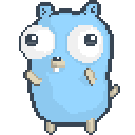

Hi, I'm Yuvraj.

  

I like building backend systems, developer tools, and Machine Learning.  
Currently into Rust, and Rust is in me.

Things I’m working on:

- **P2rent** - Basically Peer-to-peer decentralised, Micro Bit-torrent.
- **Kairo** – Static Site generator in Rust .  

Curious by default. Shipping often.
